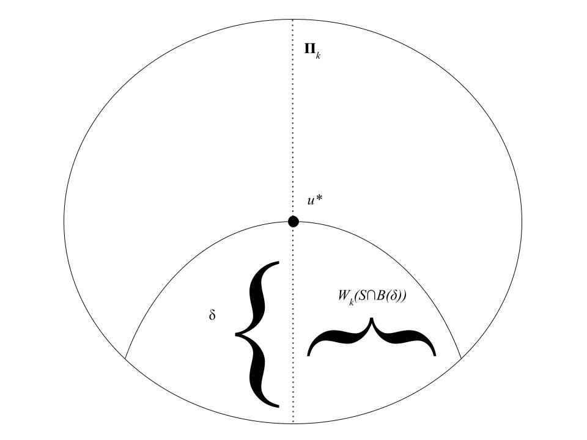

```{r setup, include=FALSE}
knitr::opts_chunk$set(echo = FALSE)

require(tidyverse)

# Learn more about creating blogs with Distill at:
# https://rstudio.github.io/distill/blog.html
```

```{r, fig.align='center', out.width="100%"}
#knitr::include_graphics("img/oil_reservoir_resize.png")
```

\newcommand{\NN}{\mbox{$\mathbb{N}$}}
\newcommand{\BB}{\mbox{$\mathbb{B}$}}
\newcommand{\ZZ}{\mbox{$\mathbb{Z}$}}
\newcommand{\QQ}{\mbox{$\mathbb{Q}$}}
\newcommand{\RR}{\mbox{$\mathbb{R}$}}
\newcommand{\PP}{\mbox{$\mathbb{P}$}}
\newcommand{\EE}{\mbox{$\mathbb{E}$}}
\newcommand{\II}{\mbox{$\mathbb{I}$}}
\newcommand{\Ss}{\mbox{$\mathbb{S}$}}
\newcommand{\TT}{\mbox{$\mathbb{T}$}}
\newcommand{\VV}{\mbox{$\mathbb{V}$}}
\newcommand{\XX}{\mbox{$\mathbb{X}$}}
\newcommand{\ff}{\mbox{$\mathcal{F}$}}
\newcommand{\rr}{\mbox{$\mathcal{R}$}}
\newcommand{\Aa}{\mbox{$\mathcal{A}$}}
\newcommand{\bb}{\mbox{$\mathcal{B}$}}
\newcommand{\cc}{\mbox{$\mathcal{C}$}}
\newcommand{\Gg}{\mbox{$\mathcal{G}$}}
\newcommand{\ee}{\mbox{$\mathcal{E}$}}
\newcommand{\jj}{\mbox{$\mathcal{J}$}}
\newcommand{\pp}{\mbox{$\mathcal{P}$}}
\newcommand{\Ll}{\mbox{$\mathcal{L}$}}

\newcommand{\norm}[1]{\left\lVert#1\right\rVert}
\newcommand{\Var}{\text{Var}}
\newcommand{\indep}{\perp\!\!\!\perp}
\newcommand{\unif}{\text{Unif}}
\newcommand{\geom}{\text{Geom}}
\newcommand{\pois}{\text{Poisson}}
\newcommand{\bin}{\text{Bin}}
\newcommand{\ber}{\text{Ber}}
\newcommand{\gam}{\text{Gamma}}
\newcommand{\TV}{\text{TV}}
\newcommand{\vv}{\ensuremath{\mathbf{v}}}


\newtheorem{theorem}{Theorem}
\newtheorem{definition}{Definition}
\newtheorem{lemma}{Lemma}

Much can be said of the Gaussian 
and Rademacher width objects. At a high level, the width of a set carries 
information about how complicated that set is and, in turn, how complicated it 
is to estimate a parameter which is one among many members of that set. Methods for bounding the width of a set have been extensively studied.

We will consider a localized notion of Gaussian width. At a high level, one 
may reason that the performance of a non-parametric estimation procedure should 
not be evaluated based on its ability to distinguish the truth from remote 
alternatives -- what really matters is its ability to distinguish the truth 
from nearby alternatives which are more likely to be confused for the truth. 
If this intuition guides toward tighter estimation rates when using local 
notions of width, then we are motivated to find easy means of estimating the 
local Gaussian width of a set about a point. A result of this kind is the 
subject of a paper by Yuting Wei, Billy Fang, and Martin Wainwright (2020, 
[@wei_gauss_2020]).

The basic idea is the following. There is some minimal dimension
$k_*\in\{1,2,\ldots,d\}$ for which $d$-dimensional data are approximated 
locally by a $k_*$-dimensional plane to $\delta$-accuracy. Then when the data 
are sufficiently regular in some sense, we can say that the local Gaussian 
width within a $\delta$-ball is the same as $\delta\sqrt{k_*}$ up to some 
universal constant. However, while Gaussian width is hard to compute, it is 
fairly easy to find $k_*$. Thus this result is quite concise and useful.

This report is organized as follows. We state all of the definitions that we 
need to make rigorous statements of the above ideas in 
[background](#background). Then we state 
the results of the paper and their most immediate consequences in 
[results](#results). We prove the first theorem in [proofs](#proofs), and we 
sketch the proof of the second (omitting a full proof which occupies five pages 
in our paper of interest). Finally, we summarize the entire report with the 
central idea and its consequences once again in [discussion](#discussion).

## Background {#background}

Again, the _Gaussian width_ of a set is some notion of its size or, roughly, 
the difficulty of an estimation problem over it.

```{definition, name="Gaussian width"}
We define the _Gaussian width_ of a set $S\subset\RR^d$ as
\begin{align*}
    \Gg(S) &:= \EE\left[\underset{u\in S}{\sup} \langle u, w\rangle\right]. && \left(w\sim N(0, I_d)\right)
\end{align*}
[Section 2.1 in [@wei_gauss_2020]]
```

```{definition, name="Localized Gaussian width"}
The _localized Gaussian width_ of $S$ at $u^*\in S$ and scale $\delta$ is 
simply $\Gg\left((S-u^*)\cap\BB(\delta)\right)$, where $S-u^*$ is the 
translation of $S$ so that $u^*$ coincides with the origin and $\BB(\delta)$ is 
an $\ell_2$ ball of radius $\delta$. [Section 3.1 in [@wei_gauss_2020]]
```

That is, it is the Gaussian width not of the whole of set $S$ but is the width 
of the subset of $S$ which contains those points which are within $\ell_2$ 
distance $\delta$ from $u^*$.

```{definition, name="Kolmogorov width"}
We define the Kolmogorov $k$-width of $S$ as
\begin{equation}
    W_k(S) := \underset{\Pi_k}{\min}\text{ }\underset{u\in S}{\max} \norm{u - \Pi_k u}_2,
\end{equation}
where the $\Pi_k$ are $k$-dimensional orthogonal linear projections. [Section 2.2 in [@wei_gauss_2020]]
```

In words, the $k$-width of $S$ is the maximum reconstruction error after 
projecting $S$ onto the best-approximating $k$-dimensional subspace. It happens 
that, in the case where $S$ is a space from which samples are observed, the 
problem of estimating the best projection $\Pi_k$ is the same problem as 
computing the $k$ first principal components of the data set. See Figure 
\@ref(fig:kolm-k-width).

```{r kolm-k-width, fig.align='center', out.width="100%", fig.cap="Intersecting an ellipse $S$ and a $\\delta$-ball around $u^*\\in S$, find the projection $\\Pi_k$ which has the minimax reconstruction error over $S\\cap \\BB(\\delta)$. That error is the local Kolmogorov $k$-width of $S$ for $u^*$"}

```

Clearly if $k=d$ the dimension of the ambient space, then there is only one 
projection to consider (which is the identity projection) and ensures that 
$W_d(S)=0$. On the other hand, if $k=0$, then once again there is only one 
projection to consider (which is the origin alone) and 
$W_0(S)=\max_{\theta\in S}\norm{\theta}_2$. Furthermore, we have that
\begin{align*}
    W_{k-1}(S) &\geq W_{k}(S). && (k=1\ldots,d)
\end{align*}
In words, the Kolmogorov $k$-width decreases as the subspaces with which we 
approximate $S$ increase in dimension; this fact is tedious to prove but 
intuitive enough and useful later.

```{definition, name="Critical dimension"}
Pick $\delta>0$ and $\eta\in(0, 0.1)$. The critical dimension of $S$ for $u^*$ 
  is 
\begin{equation}
    k_*(u^*, \delta) := \min\left\{k\in\{1,2,\ldots,d\} :  W_k\left((S-u^*)\cap\BB((1-\eta)\delta)\right) \leq 0.9\delta\right\}.
\end{equation}
[Equation 8 in [@wei_gauss_2020]]
```

As was suggested in [intro](#intro), this quantity can be considered the minimal 
dimension for which there exists a $k_*$-dimensional projection that 
approximates a neighborhood of $S$ around $u^*$ to $0.9\delta$-accuracy. In the 
case where $S$ is a space from which samples are observed, $k_*$ may be 
considered the minimum number of the top principal components of the dataset 
needed to capture $1-0.9\delta$ times the total variation in the data in the 
$\ell_2$ sense.

Note that here we consider $0.9\delta$-accuracy rather than simply 
$\delta$-accuracy for the reason that we can only expect the latter in the case 
of $k_*=d$, an uninteresting case. Instead we are much more interested in a 
small dimension at which we attain a reasonable representation of our set. We 
could alternatively pick $\eta\in(0,t)$ and pursue a $(1-t\delta)$-accurate 
$k_*$-dimensional subspace for $0<t<0.5$, say, but while toggling the parameter 
$t$ in this way may lead to interestingly different results in practice, the 
argument follows the same anyhow.

For the motivating examples of the paper, the set $S$ is a finite-dimensional 
ellipse $\ee^*_{\mu}$ which is defined as a ball 
$\BB(\theta^*; 1, \norm{\cdot}_{\mu})$ around $\theta^*$ and of radius $1$, 
where 
\begin{align*}
    \norm{\theta}_{\mu} = \sum_{i=1}^d \frac{\theta_j^2}{\mu_j}. && (\mu_1\geq\mu_2\geq\cdots\geq\mu_d\geq 0)
\end{align*}
We may ask how the difficulty of reconstructing $\ee^*_{\mu}$ with the 
projection $\pi_k$ relates to the difficulty of reconstructing another ellipse 
$\ee^*_{\gamma}$ (which is similarly defined).

```{definition, setgamma}
Consider the set
\begin{equation*}
    \Gamma(\delta, \Pi_k) := \left\{\gamma\in\RR_{+}^d : \underset{\norm{\Delta}_{\mu}\leq \delta}{\sup}\norm{\Delta-\Pi_k\Delta}_{\gamma}^2\leq 1\right\}
\end{equation*}
of all points $\gamma$ which furnish ellipses for which the reconstruction error for all $\Delta\in\ee^*_{\mu}$ is small.
```

It is in terms of this set that we state our ``regularity conditions'' for our central claim below.

```{definition, regularity}
If, of the ellipse $\ee^*_{\mu}$, we can say that
\begin{equation}
    \delta\sqrt{k_*(\delta, \theta^*)} \gtrsim \underset{\gamma\in\Gamma(\delta,\Pi_{k_*})}{\inf} \sqrt{\sum_{j=1}^d \gamma_j},
\end{equation}
then we say that $\ee^*_{\mu}$ is regular at $\theta^*$.
```

The premise of the paper is, again, as follows. If, of the ellipse $\ee^*_{\mu}$, we can say that it is regular at $\theta^*$, then the local Gaussian complexity of $\ee^*_{\mu}$ satisfies 
\begin{equation}
    \Gg\left(\ee^*_{\mu}\cap\BB(\delta)\right) \simeq \delta\sqrt{k_*(\theta^*, \delta)}.
    (\#eq:centralclaim)
\end{equation}
To show Claim \@ref(eq:centralclaim), we require an upper bound and a lower bound on the local Gaussian complexity. The upper bound is the subject of Theorem \@ref(thm:upperbound). The lower bound is the subject of Theorem \@ref(thm:lowerbound).

## Main results {#results}

Toward the statement of a result of the form of equation \ref{eq:centralclaim}, the authors offer an upper bound and a lower bound on the local Gaussian complexity of the ellipse. These are stated as follows.

```{theorem, upperbound, name="Upper bound"}
Given $\delta>0$, a tuple $(k, \Pi_k)$, and some $\theta^*\in\ee$,
\begin{equation*}
    \Gg\left(\ee^*_{\mu}\cap\BB(\delta)\right) \leq \delta\sqrt{k} + \underset{\gamma\in\Gamma(\theta^*,\delta,\Pi_k)}{\inf} \sqrt{\sum_{j=1}^d \gamma_j}.
\end{equation*}
[Theorem 1 in [@wei_gauss_2020]]
```

The proof of this theorem is reconstructed in the [proofs](#proofs) section.

```{theorem, lowerbound, name="Lower bound"}
There exist universal constants $c_1, c_2 > 0$ such that for all $\theta^*\in\ee$,
\begin{equation*}
    \Gg\left(\ee^*_{\mu}\cap\BB(\delta)\right) \geq c_1\delta\sqrt{1-\norm{\theta^*}_{\ee}^2}\sqrt{k_*(\theta^*, \delta)}
\end{equation*}
for all $\delta\in\left(0,c_2\Phi^{-1}\left((\norm{\theta^*}_{\ee}^{-1}-1)^2\right)\right)$. [Theorem 2 in [@wei_gauss_2020]]
```

The proof of this theorem is sketched in [proofs](#proofs). Now we restate equation \ref{eq:centralclaim} formally.

\begin{theorem}[Local Gaussian width under regularity]
There exist universal constants $c_0, c_1, c_2>0$ such that for any ellipse $\ee$ that is regular at $\theta^*$, we have
\begin{equation*}
    c_1\delta\sqrt{k_*(\theta^*,\delta)} \leq \Gg\left(\ee^*_{\mu}\cap\BB(\delta)\right) \leq c_2\delta\sqrt{k_*(\theta^*,\delta)}
\end{equation*}
for all $\delta\in \left(0,c_2\Phi^{-1}\left((\norm{\theta^*}_{\ee}^{-1}-1)^2\right)\right)$. [Equation 13 in [@wei_gauss_2020]]
\end{theorem}

The lower bound in this theorem is immediate from \ref{thm:lowerbound}. The upper bound can be drawn quickly from \ref{thm:upperbound} by simply noting that when the 

To further illustrate the use of the above result, the following theorem assures the reasonable scaling of the critical dimension with $\delta$ and and the ease with which it is approximately computed.

\begin{theorem}[Critical dimension under regularity]
There exist universal constants $c_0, c_1, c_2>0$ such that for any ellipse $\ee$ that is regular at $\theta^*$, we have
\begin{equation*}
    c_1 \log M\left(\frac{\delta}{2}, \ee^*_{\mu}\cap\BB(\delta)\right) \leq k_*(\theta^*, \delta) \leq c_2 \log M\left(c_0\delta, \ee^*_{\mu}\cap\BB(\delta)\right)
\end{equation*}
for all $\delta\in (0, 1/e)$. [Corollary 2 in [@wei_gauss_2020]]
\end{theorem}

## Proofs and sketches {#proofs}

```{proof, proofthmupperbound, name="Proof of upper bound"}
For $\Delta\in\ee^*_{\mu}\cap\BB(\delta)$ and $\Pi_k$ a $k$-dimensional orthogonal projection, write $\Delta=\Pi_k\Delta + (\Delta-\Pi_k\Delta)$. Then 
\begin{align*}
    \Gg\left(\ee^*_{\mu}\cap\BB(\delta)\right) &= \EE\left[\underset{\Delta\in \ee^*_{\mu}\cap\BB(\delta)}{\sup} \langle w,\Delta\rangle\right]\\
        &\leq \underset{T_1}{\underbrace{\EE\left[\underset{\Delta}{\sup} \langle w,\Pi_k\Delta\rangle\right]}} + \underset{T_2}{\underbrace{\EE\left[\underset{\Delta}{\sup} \langle w,\Delta-\Pi_k\Delta\rangle\right]}},
\end{align*}
leaving the task to bound the terms $T_1$ and $T_2$ separately.

(Bounding $T_1$.) Write
\begin{align*}
    \EE\left[\underset{\Delta}{\sup} \langle w,\Pi_k\Delta\rangle\right] &= \EE\left[\underset{\Delta}{\sup} \langle \Pi_k w,\Pi_k\Delta\rangle\right] && ((I-\Pi_k)w\perp \Pi_k\Delta)\\
        &\leq \underset{\Delta}{\sup}\norm{\Pi_k\Delta}_2 \EE \norm{\Pi_k w}_2 && (Cauchy-Schwarz)\\
        &\leq \delta \sqrt{k}
\end{align*}
using the fact that $\norm{\Delta}_2\leq \delta$ by definition and that
\begin{align*}
    \EE \norm{\Pi_k w}_2 &\leq \sqrt{\sum_{i=1}^d \EE(\Pi_k w)_i^2} && (Jensen)\\
        &\leq \sqrt{\sum_{i=1}^d \II\left\{i\leq k\right\}}\\
        &= \sqrt{k}
\end{align*}
since $\Pi_k w$ has the same distribution as a $k$-dimensional standard Gaussian random variable projected up into $d$-dimensional space and then rotated according to $\Pi_k$.

(Bounding $T_2$.) Let $A(\gamma)=\text{diag}(\sqrt{\gamma_1}, \sqrt{\gamma_2}, \ldots,\sqrt{\gamma_d}).$ Then write
\begin{align*}
    \EE\left[\underset{\Delta}{\sup} \langle w,\Delta-\Pi_k\Delta\rangle\right] &= \EE\left[\underset{\Delta}{\sup} \langle Aw,A^{-1}(\Delta-\Pi_k\Delta)\rangle\right]\\
        &\leq \underset{\Delta}{\sup} \norm{A^{-1}(\Delta-\Pi_k\Delta)}_2 \EE\norm{Aw}_2.
\end{align*}
Of the first factor, note that for all $\gamma\in\Gamma(\delta,\Pi_k)$ we have
\begin{equation*}
    \norm{A(\gamma)^{-1}(\Delta-\Pi_k\Delta)}_2 = \norm{\Delta-\Pi_k\Delta}_{\gamma}\leq 1
\end{equation*}
for all $\norm{\Delta}_{\mu}\leq 1$ by Definition \ref{setgamma}.
Of the second factor note that
\begin{align*}
    \EE\norm{Aw}_2 &\leq \sqrt{\sum_{i=1}^d \EE(A w)_i^2} && (Jensen)\\
        &= \sqrt{\sum_{i=1}^d \gamma_i}.
\end{align*}
It follows that
\begin{equation*}
    \EE\left[\underset{\Delta}{\sup} \langle w,\Delta-\Pi_k\Delta\rangle\right] \leq \underset{\gamma\in\Gamma(\delta,\Pi_k)}{\inf}\sqrt{\sum_{i=1}^d \gamma_i}
\end{equation*}
since the left-hand side does not depend on the $\gamma$. Combining this result with the bound on $T_1$ concludes the proof for Theorem 1.
```

```{proof, proofthmlowerbound, name="Sketch of proof of lower bound"}

Consider two separate cases.

(Case 1.) Suppose that $\norm{\theta^*}_{\ee}\leq\frac12$. The first step toward the claim in this setting is to show that
\begin{equation*}
    \Gg\left(\ee^*_{\mu}\cap\BB(\delta)\right) \geq \Gg\left(\BB\left(\frac{3}{10}\delta\right)\cap E_{k`_*}\right),
\end{equation*}
where $E_k\subset\RR^d$ is the subspace spanned by $\{e_1,\ldots,e_k\}$ and $k`_*\geq k_*$. In words, if $\theta^*$ is close to the center of the ellipse, then its associated local Gaussian complexity is bounded below by the local Gaussian complexity of a $k`_*$-dimensional ball. It can be checked directly that the right-hand side of the above inequality is equal to $\frac{3}{10}\delta\sqrt{k`_*}$, and by the assumption of this case we have that
\begin{equation*}
    \frac{3}{10}\delta\sqrt{k`_*} \geq \frac{3}{10}\delta\sqrt{1-\norm{\theta^*}_{\ee}^2}\sqrt{k_*(\theta^*,\delta)},
\end{equation*}
which is the result. What remains to be seen is that that inequality is in fact true. Loosely speaking, it is indeed true because the set intersection of the right-hand complexity expression is smaller than the set intersection of the left-hand complexity expression.

(Case 2.) Suppose that $\norm{\theta^*}_{\ee}\geq\frac12$. The gist of Lemmas 1 and 2 is that there exists a vector $\theta^{\dagger}\in\ee$ and a packing
\begin{align*}
    \Xi &= \{\theta^{\dagger}+\sigma^S: S\in\jj, \sigma^S \text{ $s$-sparse}\} \subset \ee,\text{ where}\\
    \jj &\subset \pp(\{\lfloor(k_*-1)/8\rfloor,\ldots,\lfloor(k_*-1)/4\rfloor\})\text{ and}\\
    s &:= \rho\frac{k_*-1}{16} &&(\rho\in(0,1))
\end{align*}
such that 
\begin{align*}
    \lvert\Xi\rvert &\geq \begin{pmatrix}
        \lfloor\frac{k_*-1}{16}\rfloor \\
        s
    \end{pmatrix},\text{ and}\\
    \delta^2 &\leq \norm{\theta^S - \theta^*}_2^2 \leq \left(\frac{4}{1-\norm{\theta^*}_{\ee}^2}\right)\delta^2.
\end{align*}
All this is to obtain a (large but tractable) collection of vectors $\Delta^S\in\ee_{\theta^*}\cap\BB(\delta)$ proportional to $\Tilde{\theta}-\theta^*$ where $\Tilde{\theta}\in\Xi$ so that
\begin{equation}
    \EE\left[\underset{\Delta\in \ee^*_{\mu}\cap\BB(\delta)}{\sup} \langle w,\Delta\rangle\right] \geq \EE\left[\underset{\Tilde{\theta}\in\Xi}{\max} \langle w,\Delta^S\rangle\right].
\end{equation}
A further Lemma 3 takes the conditions for Theorem \ref{thm:lowerbound} and combines it with the result of Lemma 2 to show that the right-hand side of the above inequality is an upper bound for $\delta\sqrt{1-\norm{\theta^*}_{\ee}^2}\sqrt{k_*}$ up to some universal constant. The argument for this step is somewhat similar to the part of the Proof of Theorem 1 (\ref{pf:proofthmupperbound}) in that one can observe that the sparsity of the $\Delta^S$ zero out $d-k^*$ entries of the Gaussian vector $w$ so that, by H\"older, the $\EE\norm{w}_{\infty}$ looks like $\sqrt{k_*}$ and the $\sup\norm{\Delta^S}_1$ looks like $\delta\sqrt{1-\norm{\theta^*}_{\ee}^2}$. This is, as one would expect, a gross oversimplification of the details of the full proof.
```


## Discussion {#discussion}

The consequences of the results discussed in the body of this report are, as promised, quite immediate for estimation rates. The set-up of the relevant estimation problem is as follows. If $\theta^*\in\ee$ an ellipse and some samples $y\sim N(\theta^*, I_n)$ are observed, then the least squares estimator 
\begin{equation*}
    \Hat{\theta} := \arg \underset{\theta\in\ee}{\min} \norm{y-\theta}_2^2
\end{equation*}
enjoys the following property.
\begin{theorem}[Least squares on ellipses ]
Let $\ee$ be regular at $\theta^*$ in the sense of \ref{def:regularity}. If $\delta_n\in(0,c)$ solves
\begin{equation*}
    \delta = \sigma\sqrt{k_*(\theta^*, \delta)},
\end{equation*}
and the function $g(\delta):= \delta^2/2-c\delta\sqrt{k_*(\theta^*,\delta)}$ is unimodal in $\delta$, and there exist constants $c',c''$ such that $k_*(c'\delta_*)\leq k_*(\delta_*)/c'$ and $c''\delta_*\geq 2\sqrt{k_*(c''\delta)}$, then
\begin{equation*}
    \norm{\Hat{\theta} - \theta^*}_2 \simeq \delta_*
\end{equation*}
with high probability. [Proposition 1 in [@wei_gauss_2020]]
\end{theorem}

This result is quite similar to what we already know about the relation between global Gaussian width and least squares estimation rates on ellipses. This topic is discussed at length in [@j_wainwright_high-dimensional_2019].

Can these results for bounding the local Gaussian width be imported to the question of bounding global Gaussian width? Not immediately can they be, but consider this. The hardest vector $\theta^*\in\ee$ to estimate is the zero vector since this is where the ellipse is the ``widest,'' and the critical dimension of the ellipse around $0$ is naturally going to be higher than the critical dimension anywhere else. Although $\Gg(\ee_0\cap\BB(\delta))$ is not exactly $\Gg(\ee)$, the two help capture the minimax difficulty of the estimation problem over $\ee$.
