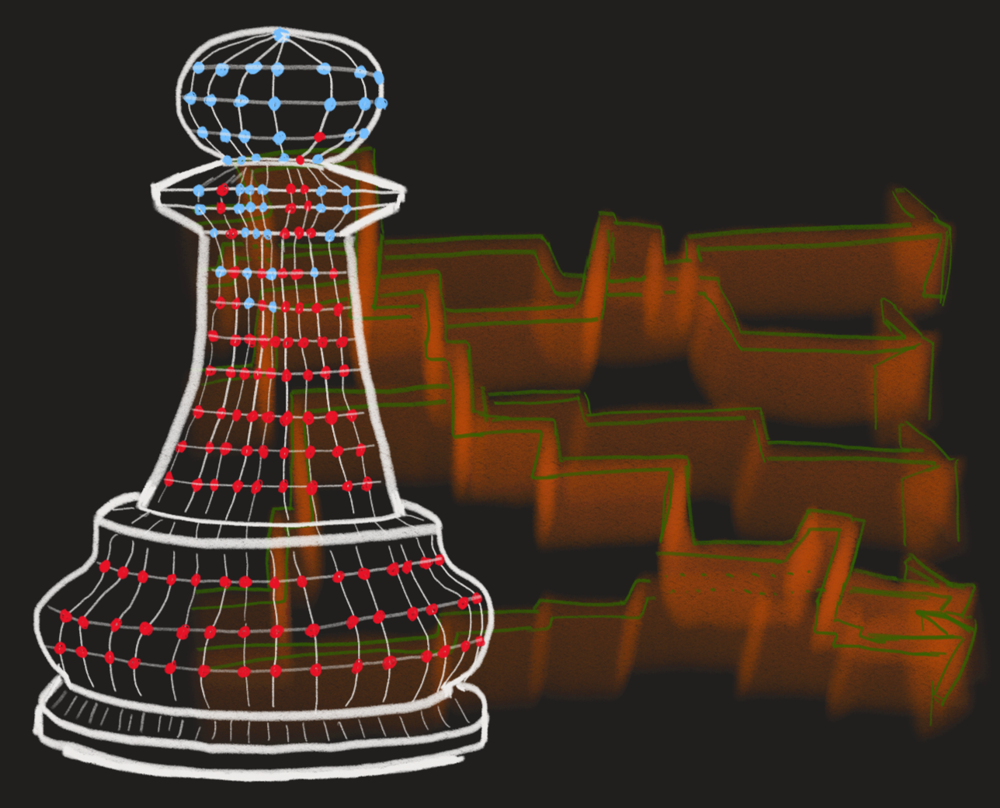

```{r setup, include=FALSE}
knitr::opts_chunk$set(echo = FALSE)

# Learn more about creating blogs with Distill at:
# https://rstudio.github.io/distill/blog.html

```

```{r, fig.align='center'}

```

It is imperative that you establish your chess skill level as soon as possible. 
There is simply too much at stake to live your 21st century life in tactical 
darkness. If you seriously think 
that you can walk around inside this world with nothing but the minimal 
knowledge of how the pieces move and still hold your head high at night, then 
you've already lost. Mark my words, you will be the one left sitting on the 
curb 
outside Pizza Hut with your 
confidence shattered and your carpal tunnels throbbing while a confederacy of 
twelve-year-olds will be standing 
around you with their hands making knight-jump-shapes on their acne-ridden foreheads. There is no coming back from this disaster.

As a kid, I did not believe myself to be mathematically competent, let alone 
gifted, and I assumed that good play of chess required some sort of talent. 
When I started playing chess in college, I marvelled at my opponents' good 
fortune. I thought to myself as I lost time and again, _I'd done nothing wrong! 
I traded pieces for pieces, I didn't walk into check, and I kept my queen next 
to my king! How could I have lost?_

The circumstances of the COVID-19 pandemic kindled a change in my attitude 
about the game. I found it to be an opportune activity to share remotely with 
my friends and a skill in which I was certainly capable of improving. The 
practice of learning to play better chess (as opposed to the practice itself of 
playing chess) is very satisfying now, because I no longer embarrass myself and 
have a renewed admiration for my ability to cling to mediocrity in a broad 
range of skills in which most people either find great success or total disdain.

This post is a reflection of my current state in the hobby of online chess. As 
an educational exercise and for curious readers, I want to document my thought 
process qualitatively. Additionally, in the interest of learning more about how my progress is measured, I investigate the "elo rating." This investigation I 
share with you now.

<iframe src="https://lichess.org/embed/0Hxq5ZmB#35?theme=auto&bg=auto"
width=600 height=397 frameborder=0></iframe>

# Elo as proxy

It would be convenient to know your genuine world ranking in chess like how you 
know your height, but you can't practically determine such a thing. The only 
way to decide how good people really are is to make everyone play against 
everyone else infinitely many times and then line up in such a way that 
no one is standing behind someone against whom they win more than half of the 
time. But such a tournament is impractical since we would not have anyone to 
wash our clothes or to clean after the horses on Mackinac Island, and so we 
will never know how good we really are.

But it is rather obvious that we may guess how good we are at the game, and to 
guess with improving certainty with more and more play, without ever actually 
measuring skill. To have a good guess, let's just order everyone that you've played against according to your win percentage. You can stand in front of the 
people against whom you normally win, but you must stand behind those who beat 
you. How good is the person standing in front of you? And behind? Average their 
true rankings to approximate your own.

$$\frac{Pr(A\text{ beats }B)}{Pr(B\text{ beats }A)} = \frac{Pr(A\text{ beats }B)}{1-Pr(A\text{ beats }B)} = 10^{\frac{R_A-R_B}{400}}.$$

Link: https://chance.amstat.org/2020/09/chess/

# Don't trot out the queen

# Playing chess like you care

