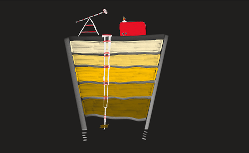
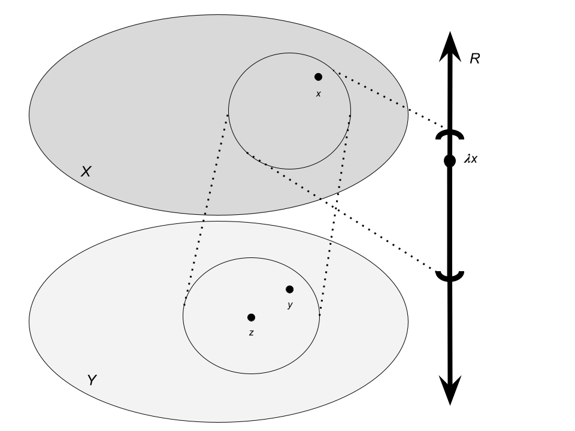

```{r setup, include=FALSE}
knitr::opts_chunk$set(echo = FALSE)

require(tidyverse)

# Learn more about creating blogs with Distill at:
# https://rstudio.github.io/distill/blog.html
```

```{r, fig.align='center', out.width="100%"}

```

Suppose, for the sake of an analogy, that your name is Daniel Plainview and 
that your milkshake doesn't taste like it used to. Something's off about it. 
Are there Oreo chunks at the bottom that you just didn't catch earlier? Is the 
extra Nesquik powder clumping up? You have to try a little bit harder to yield 
the same volume of shake now than you did on first suck, and you require a bit 
of trial and error to find the optimal technique.

If this sounds like a problem that you have faced before (and suppose, for the 
sake of my argument, that it does), then you might be an oil reservoir 
engineer.^[In other words, if you might not be an oil reservoir engineer, then 
this doesn't sound like a problem that you have faced before. Since most people 
are not oil reservoir engineers, most people might not be. It follows that most 
people cannot relate to my analogy. For this reason I encourage you all to one 
day try a milkshake and decide for yourself later with better information 
whether this blog post is worth your time rather than deciding against reading 
it on account of it not being relevant to you.] Daniel's strategic approach to 
the problem of pumping petroleum in the film _There Will Be Blood_ is not 
described in exceedingly technical detail; the dramatic intrigue comes from his 
complex personal machinations and manipulations, not the trivia of maintaining 
OSHA-compliant wells. In the sequel, _There Will Be Sweat_, Daniel does have to 
pivot into the natural gas industry, and there is a long, boring, drawn out 
sequence where he goes down a [Wikipedia rabbit hole on different accidents that 
occurred in the United States related to natural gas production](https://en.wikipedia.org/wiki/List_of_natural_gas_and_oil_production_accidents_in_the_United_States). But one can reasonably presume that oil pumping is a non-trivial 
affair since it requires very expensive straws that are designed for drinking 
extremely deep "milkshakes" found in glasses of complex shapes (and part of my 
point is that it would make for a really good movie I think if they leaned into 
this aspect of the industry a bit more in the movie). It's a complex 
engineering endeavour, and there was room for data science to improve it once 
computers became accessible to the engineers who cared about it. The state of 
the art method for a particular aspect of the industry as of the 1970s is this 
method called "history matching."

In this post, I will explain what this method is and how it is related to other
applications and ideas in data science. As it turns out, history matching is 
employed in many problems nowadays, but the literature on its theoretical 
guarantees and statistical properties still seems to be somewhat 
underdeveloped. One of my current projects studies the method while regarding 
it as a means for uncertainty quantification, which is slightly different from 
its original use and should serve as an independent post in the future. For 
now, I will focus on the application to computer model calibration.

# What is a history match?

Let there be something we can measure. If we own an oil well, then maybe we can 
easily measure the amount of oil we produce in a week as well as the oil 
pressure at the point where we're drilling. Call the space of (production, 
pressure) pairs $Y$. Let there also be something that we can't measure but 
which has an effect on the things that we can. In our example, maybe the 
porosity of the rock in which the reservoir of oil is found is hard to measure, 
but it will effect how much oil is sitting inside and thus how much can be 
produced at that location. Call the space of possible porosities $X$. Let 
$F: X\rightarrow Y$ be a computer program or mathematical model for a 
drilling procedure which takes as input some point in $X$ and gives a point in 
$Y$ as the procedure's predicted output. 
If we are scientists, then maybe we are interested 
in the porosity for its own sake. If we are a drilling company, then maybe we 
are more specifically interested in how the porosity will affect our 
productivity next week. We'll suppose that the quantity of interest is 
described by another program or function $\lambda: X\rightarrow\mathbb{R}$, and
so the space of possible future production levels is $\mathbb{R}$.

Our pipeline -- if you will -- for making some prediction for next week's 
production level is as follows. Let $x\in X$ be the true porosity, $y\in Y$ 
be the true (production, pressure) pair, and $z\in Y$ be the (production, 
pressure) pair that was actually measured, as in Figure 
\@ref(fig:history-matching). (Maybe there was some small amount 
of error when measuring.) Our goal is to first take $z$ and find a point 
$x'\in X$ such that $F(x')=z$. Our point $x'$ is our best guess for $x$. Then 
$\lambda x'$ is our production prediction.

In practice, the pipeline is a bit more complicated than this. Maybe we would 
like to think that for any point $x'\in X$, if $F(x')=z$, then $x'=x$. Firstly, 
we should be prepared for the scenario in which our measurements $z$ are 
slightly wrong since our measurements for pressure or volume of oil might be 
rounded off or estimated at some point. Secondly, even if we didn't have this 
error, it's possible that $F$ is a function which is not a one-to-one map. That 
is, if you draw its graph (say, production versus porosity) and then draw a 
horizontal line at the production level, then it might not pass the 
horizontal line test. Maybe two different porosities, $x'$ and $x''$ would 
determine the same production levels. Then which is the best prediction for 
$x$? For this reason, we will relax our goal. Rather than identifying a point 
prediction for $x$, we will seek a set $\Xi\subset X$ which includes all of our 
best predictions for $x$. In particular, we will take the set $\Sigma$ of all 
$y'\in Y$ such that $y'-z$ is less than the maximum amount of error that we 
expect to see from our instruments with which we measure production and 
pressure, and then compute $\Xi=F^{-1}(\Sigma)$, the set of all $x'\in X$ such 
that $F(x')\in\Sigma$. That is a reasonable goal.

```{r history-matching, fig.align='center', out.width="100%", fig.cap="A schematic view of the problem pursued by history matching. Give constraints on $\\lambda x$ from observations $z\\in Y$ by estimating error $z-y$ and finding the preimages $x\\in X$ which are close to $z$ up to that error level."}

```

# How to solve an inverse problem

With the problem and its participating objects described in the abstract, we 
need to decide how to perform history matching concretely. We will see how 
first to write down an _implausibility metric_ and then we will invert the 
metric to obtain an 
implausibility region over $X$. Under some conditions on the function $F$, the 
inversion step can be a relatively simple process. In general, the only 
practical solution is to get a Monte Carlo sample of metric values and 
approximate $\Xi$.

## Implausibility metric

Suppose that $Y=\mathbb{R}$, just one scalar quantity, and of $F$ it is known 
how to compute the mean and covariance of the outcome. That is,

\begin{align*}
  \mu(x) &= \mathbb{E}[F(x)]\text{, and}\\
  \sigma^2(x) &= \mathbb{E}[F(x)^2] - \mathbb{E}[F(x)]^2
\end{align*}

are both computable. Then the natural implausibility metric is

\begin{equation*}
  \gamma(x) = \frac{\lvert\mu(x)\rvert}{\sigma(x)}
\end{equation*}

because it accounts for uncertainty $\sigma^2(x)$ in a natural way. More 
generally, we may want to consider multiple measurements -- in our motivating 
oil reservoir example, the two measurements are production level and oil 
pressure. Then we will assume that we can measure $D$ quantities $F_i$, 
$i=1,\ldots, D$ and then compute

\begin{align*}
  \mu(x) &= (\mathbb{E}[F_i(x)])_{i=1,\ldots,D}\text{, and}\\
  \Sigma(x) &= (\mathbb{E}[F_i(x)F_j(x)] - \mathbb{E}[F_i(x)]\mathbb{E}[F_j(x))_{i,j=1,\ldots,D}.
\end{align*}

Two candidates for the role of this multi-measurement implausibility metric 
most prominently present themselves in the literature. The first is an $L_2$ 
norm based metric,

\begin{equation}\label{eq:metric_1}
  \mathscr{I}(x) = \mu^T(x)\Sigma^{-1}(x)\mu(x),
\end{equation}

and the second is an $L_\infty$ norm based metric,

\begin{equation}
  \mathscr{I}(x) = \underset{i}{\max}\lvert \gamma_i(x)\rvert,
\end{equation}

where the $\gamma_i$ are defined like $\gamma$ but for each component of $F$.

## Inversion step

Referring back to Figure 1, we will use a choice of implausibility metric to 
obtain the set $\Xi$. This is simply the subset of $X$ which produces small 
implausibilities. On the one hand, one could tune the implausibility threshold 
so that the volume of $\Xi$ is fixed. (This is what I see history matching 
practitioners do most often.) On the other hand, one may desire a probabilistic 
interpretation for $\Xi$ e.g. ``The true conditions / parameter levels lie in 
$\Xi$ with 95\% confidence.'' This requires some assumptions on the distribution 
of the data so that a notion of confidence is explicit. This is, in my opinion, 
a harder question since its appropriateness depends on the quality of the 
analyst's modeling choices; this question could be treated more thoroughly in a 
later post in lieu of expanding on recent work of my own. For reference, the 
former approach to the inversion step is seen in [@johnson_robust_2020] for 
constraining parameters which underly atmospheric aerosol climate models, and 
then my forthcoming paper in *Environmental Data Science* will view those same 
models but provide probabilistic constraints. The preprint can be found on 
*arXiv* [@carzon_statistical_2023].
